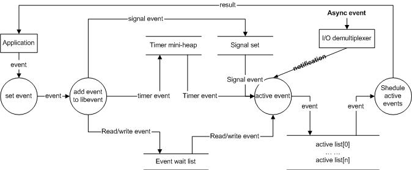

## 概述

我本次阅读libevent源码分析主要学习了libevent的事件注册和分发处理机制，对Reactor模式有了一些了解，参考的是张亮写的这篇[libevnet源码深度剖析](http://blog.csdn.net/sparkliang/article/category/660506)。

## Reactor模式

Reactor模式简单说就是一个回调分发机制，把自己感兴趣事件对应的处理方式写好，绑定到对应的事件上，然后将这些事件交由Reactor进行监听，Reactor的监听则使用多路复用机制，统一管理IO，可以检测到是否有对应的IO已经准备就绪，如果有一个或多个准备就绪，则调用对应的回调来处理这些事件，这样可以减少由于单个事件的同步而阻塞所浪费的时间。

Reactor模式的优点如下：

> 1. 响应快，不必为单个同步时间所阻塞，虽然Reactor本身依然是同步的
> 2. 编程相对简单，可以最大程度的避免复杂的多线程及同步问题，并且避免了多线程/进程的切换开销
> 3. 可扩展性，可以方便的通过增加Reactor实例个数来充分利用CPU资源
> 4. 可复用性，reactor框架本身与具体事件处理逻辑无关，具有很高的复用性

Reactor模式使用的依然是单线程的处理方式，在Reactor的事件处理循环中依然是阻塞的，不过其好处在于将所有事件的处理回调绑定到了同一个Reactor上，多个事件并不会逐一阻塞线程，而是阻塞在多路复用的等待中，这样对于所绑定的事件，不会因为前一个事件的阻塞导致后面的事件没有得到及时响应。当然需要注意的是事件的及时响应还是相对的，多路复用提供了多个事件同时等待IO资源的方式，但是当多个资源均可用，进行回调处理的时候依然是同步的，需要在单线程内逐一执行对应的回调来处理，如果某个事件的回调处理函数中出现了阻塞依然会导致后面的事件没有被及时回调。

## event实现

### event结构

event结构封装了一个事件处理所需要的信息，提供给Reactor在资源可用时进行调用。

event结构如下：

``` c
struct event {  
 /* TAILQ_ENTRY (event) 是一个双向链表的节点，内部存储着指向前后节点的指针 */
 TAILQ_ENTRY (event) ev_next;         /* 事件在已注册事件列表中的位置 */
 TAILQ_ENTRY (event) ev_active_next;  /* 事件在激活列表中的位置 */
 TAILQ_ENTRY (event) ev_signal_next;  /* 事件在信息事件列表中的位置 */
 unsigned int min_heap_idx;           /* 事件在管理超时事件的最小堆中的位置 */
 struct event_base *ev_base;          /* 事件被绑定到的Reactor实例 */
 int ev_fd;        /* 事件对应的资源描述符 */
 short ev_events;  /* 需要监听的事件 */
 short ev_ncalls;  /* 需要回调的次数 */
 short *ev_pncalls; /* Allows deletes in callback */
 struct timeval ev_timeout;  /* 超时时间 */
 int ev_pri;  /* 优先级，小数代表高优先级 */
 void (*ev_callback)(int, short, void *arg);  /* 回调函数 */
 void *ev_arg;  /* 回调函数的最后一个参数 */
 int ev_res;  /* result passed to event callback */
 int ev_flags;
};
```

然后又提供了一些函数接口来进行event的设置，包括设置event的回调函数，注册event和设置event的优先级：

``` c
void event_set(struct event *ev, int fd, short events,
               void (*callback)(int, short, void *), void *arg);
int event_base_set(struct event_base *base, struct event *ev);
int event_priority_set(struct event *ev, int pri);
```

从event的结构体中的3个链表和1个最小堆索引可以看出不同event的管理方式不同，对于普通的IO和信号事件采用链表进行管理，超时事件采用最小堆管理，使用最小堆的好处在于可以立即获取到最短的超时时间，以此来进行多路复用超时的设置，同时最小堆的插入和删除操作的时间复杂度都是log(n)，效率也较高。

### 最小堆

libevent对最小堆的调整过程进行了优化。

经典的最小堆在处理插入操作时，首先将元素插入新位置，然后依次与父节点进行比较，判断是否需要将节点上移。经典最小堆调整过程如下：

>``` c
>Heap[size++] = new; // 先放到数组末尾，元素个数+1  
>// 下面就是shift_up()的代码逻辑，不断的将new向上调整  
>_child = size;  
>while(_child>0) // 循环  
>{  
>   _parent = (_child-1)/2; // 计算parent  
>   if(Heap[_parent].key < Heap[_child].key)  
>      break; // 调整结束，跳出循环  
>   swap(_parent, _child); // 交换parent和child  
>}  
>```
>
> 

而libevent不是直接将新元素插入最小堆中进行调整，而是预先为新元素的位置留空，将新元素与父节点进行比较如果新元素需要上移，则将父节点的值移动到预留的位置，父节点的位置空出作为新元素的位置，依次与父节点进行比较，这样的操作调整位置只需要做1次赋值操作，另外预留位置也需要1次赋值，相比交换元素需要进行的3次赋值操作有一些效率上的提高。libevent的最小堆调整过程如下：

> ``` c
> _hole = size; // _hole就是为new预留的位置，但并不立刻将new放上  
> while(_hole>0) // 循环  
> {  
>     _parent = (_hole-1)/2; // 计算parent  
>     if(Heap[_parent].key < new.key)  
>         break; // 调整结束，跳出循环  
>     Heap[_hole] = Heap[_parent]; // 将parent向下调整  
>     _hole = _parent; // 将_hole调整到_parent  
> }  
> Heap[_hole] = new; // 调整结束，将new插入到_hole指示的位置  
> size++; // 元素个数+1  
> ```
>
> 

### event的管理方法

libevent对event的管理方法如图所示：

> 

在上图中看到的不同管理列表虽然都有event，但这些event**不是**在这些列表中都存在的一份拷贝，实际上每个事件只有一个event结构体，在结构体内直接用指针将这些事件按照不同的管理规则链接在一起。这样的管理操作一方面可以减少内存的占用，另一方面可以减少拷贝的操作，提高event在不同列表中修改位置的效率。

## event\_base实现

### event\_base结构

event\_base作为libevent的事件处理框架，提供了对应的信息用于处理激活的事件，控制Reactor事件处理的过程。

event\_base结构如下：

``` c
struct event_base {
 /* eventop结构中存储的是不同多路复用机制下具体操作的实现
  * 包括初始化、注册、删除、分发、注销等操作 */
 const struct eventop *evsel;  /* 多路复用机制的选择 */
 void *evbase;　  /* 对应的多路复用对象 */
 int event_count;  /* 已注册事件总数 */
 int event_count_active; /* 激活事件数量 */
 int event_gotterm;  /* 退出主循环(会在完成对应次数的激活事件回调处理后退出) */
 int event_break;  /* 立即退出主循环(完成本次回调处理后立即退出) */
 /* active event management */
 struct event_list **activequeues;  /* 激活事件的列表，每个优先级都有一个单独列表 */
 int nactivequeues;  /* 不同优先级列表数量 */
 /* signal handling info (信号处理这部分暂未深入了解) */
 struct evsignal_info sig;
 struct event_list eventqueue;
 struct timeval event_tv;
 struct min_heap timeheap;
 struct timeval tv_cache;
}; 
```

event\_base中的eventop相当于提供了一个通用的多路复用机制对象，将内部的具体实现细节给隐藏了，而event\_base则在此基础上再进行了封装，将相关的信息都记录下来，而当我们在进行事件的注册和处理时，实际上对应的注册和回调的工作是由eventop来进行的，eventop中提供的多路复用机制均实现了初始化、注册、删除、分发、注销这些接口，而其中的某一种多路复用，即event\_base中的evbase，对事件做了最终的操作。

### 接口函数

event\_base只是作为一个Reactor模型的外壳，我们可以通过调用提供的接口函数进行函数的注册、注销、分发、回调等操作。具体提供的几个接口函数如下：

``` c
int  event_add(struct event *ev, const struct timeval *timeout);  
int  event_del(struct event *ev);  
int  event_base_loop(struct event_base *base, int loops);  
void event_active(struct event *event, int res, short events);  
void event_process_active(struct event_base *base);   
```

event\_add和event\_del是对应的事件注册和注销函数。注册函数将事件注册到给定的event\_base上，如果注册成功将事件插入到已注册链表中，如果事件有给定的超时时间，则同时将事件注册到超时事件的最小堆中。类似的注销事件需要判断事件的类型进行操作，如果是IO事件则从多路复用上将事件注销，如果是定时事件则将事件从最小堆上删除。

event\_base\_loop是Reactor模型下实际进行多路复用的监听和事件的处理的主循环，循环内的具体操作将在下一节中做出分析。

event\_active可以将对应的事件加入激活列表中。而event\_process\_active则是实际处理激活列表中事件回调的函数。实际处理激活列表的流程是按照列表的优先级，从优先级最高的事件开始，逐一处理这个优先级下激活列表中的事件回调，然后再到低优先级，因此优先级较低的事件在处理时需要等待前面的事件都处理完毕，有可能会得不到及时的处理。

## 事件处理流程

### Reactor模型

libevent整体上就是一个Reactor模型，如下图所示：

> 

客户在编写程序的时候，首先将事件设置好，注册进libevent中，按照不同的事件类型加入不同的事件列表，然后根据这些事件设置多路复用监听的资源，当资源可用或者发生超时时，将对应的事件加入激活列表，然后再逐一处理激活列表中的事件回调，然后继续监听资源，直到事件都处理完毕，或出现异常，或用户调用退出函数，退出主循环。

### 事件处理主循环

libevent将所有IO、定时、信号事件都统一在一起，在同一个主循环中进行处理，主循环的操作流程如下图所示：

> 

可以看到在循环的开始位置，首先需要进行的操作是对时间的校正，并对最小堆中的时间进行相应的更新，这样从最小堆中选择的时间才是真正从主循环开始到当前的时间，依此作为多路复用的超时时间完成对定时事件的处理。

然后在多路复用阻塞返回后，可以根据返回的结果判断对应的资源状态以及是否超时，逐一检查对应的信息，依次将信号事件、IO事件、超时事件加入激活列表中，同时将超时事件从最小堆中移除，最后按照优先级处理激活列表中的回调。

这样就完成了一轮对应事件的处理，然后判断循环的状态是否回到循环起点，重新同步时间，继续循环直到结束。

### 主循环代码

参考的博客中对主循环的代码分析地较为清晰，这里就直接引用对应的代码注释作为记录。

``` C
int event_base_loop(struct event_base *base, int flags)  
{  
    const struct eventop *evsel = base->evsel;  
    void *evbase = base->evbase;  
    struct timeval tv;  
    struct timeval *tv_p;  
    int res, done;  
    // 清空时间缓存  
    base->tv_cache.tv_sec = 0;  
    // evsignal_base是全局变量，在处理signal时，用于指名signal所属的event_base实例  
    if (base->sig.ev_signal_added)  
        evsignal_base = base;  
    done = 0;  
    while (!done) { // 事件主循环  
        // 查看是否需要跳出循环，程序可以调用event_loopexit_cb()设置event_gotterm标记  
        // 调用event_base_loopbreak()设置event_break标记  
        if (base->event_gotterm) {  
            base->event_gotterm = 0;  
            break;  
        }  
        if (base->event_break) {  
            base->event_break = 0;  
            break;  
        }  
        // 校正系统时间，如果系统使用的是非MONOTONIC时间，用户可能会向后调整了系统时间  
        // 在timeout_correct函数里，比较last wait time和当前时间，如果当前时间< last wait time  
        // 表明时间有问题，这是需要更新timer_heap中所有定时事件的超时时间。  
        timeout_correct(base, &tv);  
     
        // 根据timer heap中事件的最小超时时间，计算系统I/O demultiplexer的最大等待时间  
        tv_p = &tv;  
        if (!base->event_count_active && !(flags & EVLOOP_NONBLOCK)) {  
            timeout_next(base, &tv_p);  
        } else {  
            // 依然有未处理的就绪时间，就让I/O demultiplexer立即返回，不必等待  
            // 下面会提到，在libevent中，低优先级的就绪事件可能不能立即被处理  
            evutil_timerclear(&tv);  
        }  
        // 如果当前没有注册事件，就退出  
        if (!event_haveevents(base)) {  
            event_debug(("%s: no events registered.", __func__));  
            return (1);  
        }  
        // 更新last wait time，并清空time cache  
        gettime(base, &base->event_tv);  
        base->tv_cache.tv_sec = 0;  
        // 调用系统I/O demultiplexer等待就绪I/O events，可能是epoll_wait，或者select等；  
        // 在evsel->dispatch()中，会把就绪signal event、I/O event插入到激活链表中  
        res = evsel->dispatch(base, evbase, tv_p);  
        if (res == -1)  
            return (-1);  
        // 将time cache赋值为当前系统时间  
        gettime(base, &base->tv_cache);  
        // 检查heap中的timer events，将就绪的timer event从heap上删除，并插入到激活链表中  
        timeout_process(base);  
        // 调用event_process_active()处理激活链表中的就绪event，调用其回调函数执行事件处理  
        // 该函数会寻找最高优先级（priority值越小优先级越高）的激活事件链表，  
        // 然后处理链表中的所有就绪事件；  
        // 因此低优先级的就绪事件可能得不到及时处理；  
        if (base->event_count_active) {  
            event_process_active(base);  
            if (!base->event_count_active && (flags & EVLOOP_ONCE))  
                done = 1;  
        } else if (flags & EVLOOP_NONBLOCK)  
            done = 1;  
    }  
    // 循环结束，清空时间缓存  
    base->tv_cache.tv_sec = 0;  
    event_debug(("%s: asked to terminate loop.", __func__));  
    return (0);  
}  
```

## 小结

libevent采用了Reactor模型进行多路复用的事件注册和分发，采用这个模型可以有效减小不必要的等待资源的阻塞时间，通过多路复用统一管理资源和回调操作，这些用户编写出的代码结构也比较清晰。

整体的代码思路是：首先构建一个event对象，在event对象中存储各种事件的信息和回调操作等，为了减少内存的占用和拷贝，直接在event对象中实现所需要的链表，记录堆中的下标，然后将这些事件注册到event\_base当中，通过event\_base统一管理，进行多路复用的监听，多路复用的超时时间则根据定时事件的最小时间来设置，这样就实现了IO事件和定时事件的统一，多路复用的阻塞返回后，判断对应的资源状态和事件，将资源可用或超时对应的事件加入激活列表中，然后统一进行回调处理。